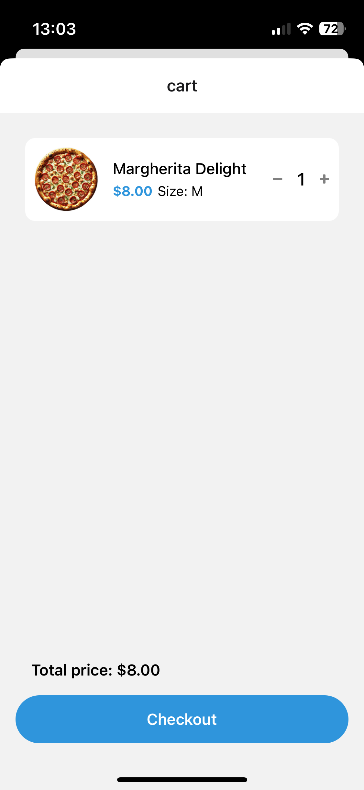
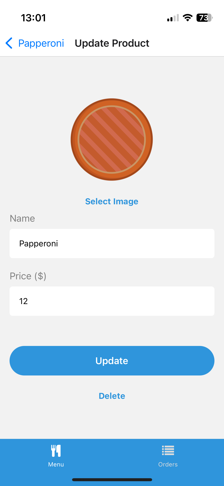

# React Native Supabase Learning Project

## Features

- User and Admin authentication (signup, login, logout)
- Menu screen: Browse products and add them to the cart (modal)
- Cart: Review selected items and create an order
- Orders screen: View and manage orders, with real-time updates from the database
- Admin features: Add and edit products, manage all user orders, and update delivery statuses
- Push notifications for users when the order status is updated (implemented with Expo Notifications)
- Responsive UI across mobile devices

## Technologies Used

- [React Native](https://reactnative.dev/)
- [Supabase](https://supabase.com/)
- [Expo](https://expo.dev/)
- [TypeScript](https://www.typescriptlang.org/)

## Screenshots

### Menu Screen

    
    

### Product Screen

### Cart (Modal)

### Orders Screen

### One Order

    
    

### Create And Update

    
    

## Acknowledgements

This project is based on the tutorial provided by [notJust.dev](https://notjust.notion.site/React-Native-Supabase-Masterclass-47a69a60bc464c399b5a0df4d3c4a630)